<!-- ============================= HERO ============================= -->

 

<!-- ============================= ABOUT ============================= -->

<!-- ========================= WHAT I BUILD ========================= -->

<!-- =========================== TECH STACK =========================== -->

<!-- ============================ PROJECTS ============================ -->

<!-- ============================== STATS ============================== -->

<!-- ============================= CONTACT ============================= -->

