<!--
  One continuous page. Each section is a full-bleed SVG that shares a single
  alignment grid, a vertical rail at x=36 and a 56px background grid offset by
  the section's cumulative Y, so the whole profile reads as one scrolling site.
  align="left" floats the images, which removes the inline-layout gaps that
  would otherwise show a seam between sections.
  Sections are generated - see assets/ and keep the shared tokens in sync.
-->





<a href="https://github.com/umerqureshi40116/IMERA_AI_AI_POWERED_FULL_STACK_APPLICATION"></a>

<a href="https://github.com/umerqureshi40116/CLOTHING_VIRTUAL_TRYON_WEB_APPLICATION"></a>

<a href="https://github.com/umerqureshi40116/Brain_Tumor_Detection_DL"></a>

<a href="https://github.com/umerqureshi40116/Heart_Disease_Prediction"></a>

<a href="https://github.com/umerqureshi40116/waze_enterprises_water_project"></a>

<a href="https://github.com/umerqureshi40116/ANF_HQ_VERSION"></a>

<a href="mailto:umerqureshi40116@gmail.com"></a>

<a href="https://www.linkedin.com/in/muhammad-umer-qureshi-376286199"></a>

<a href="https://www.codematically.com"></a>


 
