  

## About

Hi, I'm **Umer Qureshi** — a developer building **web, AI and automation** solutions.
I design and ship client websites, full-stack apps and machine-learning projects, from idea to deployment.

- 🌍 Based in **Islamabad, Pakistan**
- 🎓 **NUTECH** graduate, class of **2025**
- 🚀 Building web, AI and automation solutions at [**Codematically**](https://www.codematically.com)
- 📬 Open to **freelance projects and collaborations**

## What I build

<table>
  <tr>
    <td width="33%" valign="top">
      <h3>🌐 Web</h3>
      Responsive, fast, modern websites and full-stack applications for businesses and academies.
    </td>
    <td width="33%" valign="top">
      <h3>🤖 AI &amp; ML</h3>
      Deep learning and prediction models for healthcare, computer vision and AI-powered apps.
    </td>
    <td width="33%" valign="top">
      <h3>⚙️ Automation</h3>
      Python scripts and workflows that remove repetitive work and connect your tools.
    </td>
  </tr>
</table>

## Tech stack

## Featured projects

<table>
  <tr>
    <td width="50%" valign="top">
      <h4><a href="https://github.com/umerqureshi40116/IMERA_AI_AI_POWERED_FULL_STACK_APPLICATION">IMERA AI</a></h4>
      AI-powered full-stack application.  
      
    </td>
    <td width="50%" valign="top">
      <h4><a href="https://github.com/umerqureshi40116/CLOTHING_VIRTUAL_TRYON_WEB_APPLICATION">Virtual Try-On Web App</a></h4>
      Clothing virtual try-on system in the browser.  
      
    </td>
  </tr>
  <tr>
    <td width="50%" valign="top">
      <h4><a href="https://github.com/umerqureshi40116/Brain_Tumor_Detection_DL">Brain Tumor Detection</a></h4>
      Deep learning for medical image analysis.  
      
    </td>
    <td width="50%" valign="top">
      <h4><a href="https://github.com/umerqureshi40116/Heart_Disease_Prediction">Heart Disease Prediction</a></h4>
      Machine-learning model for healthcare prediction.  
      
    </td>
  </tr>
  <tr>
    <td width="50%" valign="top">
      <h4><a href="https://github.com/umerqureshi40116/waze_enterprises_water_project">Waze Enterprises Water Project</a></h4>
      Python project for a water business.  
      
    </td>
    <td width="50%" valign="top">
      <h4><a href="https://github.com/umerqureshi40116/ANF_HQ_VERSION">ANF HQ</a></h4>
      Python application.  
      
    </td>
  </tr>
</table>

## GitHub stats

  

## Let's work together

