<!-- Generated by scripts/build_profile.py in the Codematically theme. Edit the script, not this file. -->

<a href="https://www.codematically.com"></a>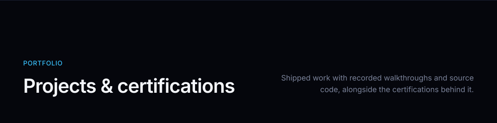<a href="https://drive.google.com/file/d/1ADYD4-VLENIl5wpVcwQCjj3JnWEkcZ8u/view"></a><a href="https://drive.google.com/file/d/12ThjJ4lltkZ713NRziuk2WTrP_Vsc0dS/view"></a><a href="https://github.com/umerqureshi40116/ANF_HQ_VERSION">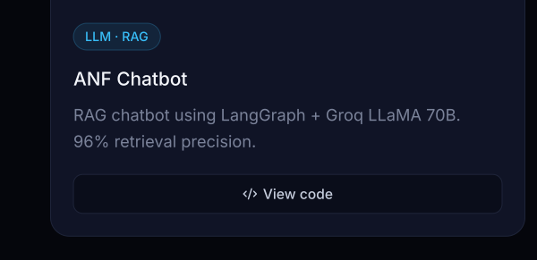</a><a href="https://github.com/umerqureshi40116/waze_enterprises_water_project">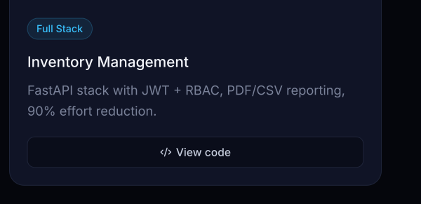</a><a href="https://drive.google.com/file/d/1UNe8ilI9XRjxcTQmocBqi1wA1jUGTqH_/view"></a><a href="https://drive.google.com/file/d/1HyLwy8-XnjR05BhAOPoh0omCDKFYkSyK/view"></a><a href="https://github.com/umerqureshi40116/Brain_Tumor_Detection_DL">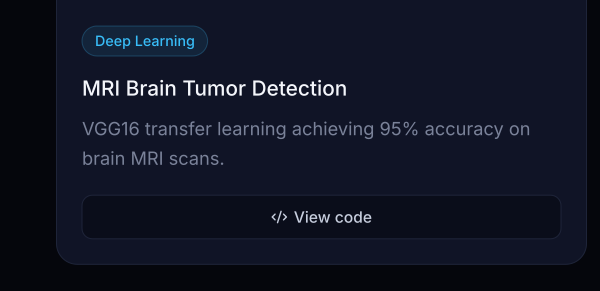</a><a href="https://github.com/umerqureshi40116/Heart_Disease_Prediction">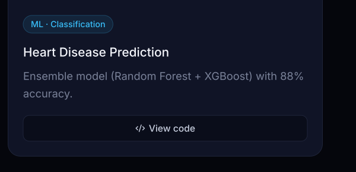</a><a href="https://drive.google.com/file/d/1oil1LGhQBNGLCdxIA9NjxiA-PdM6tLaR/view"></a><a href="https://drive.google.com/file/d/1YjrUK0bEge-1vks2XXU4U1NcXEu-KhB_/view"></a><a href="https://github.com/umerqureshi40116/call_center_supervision">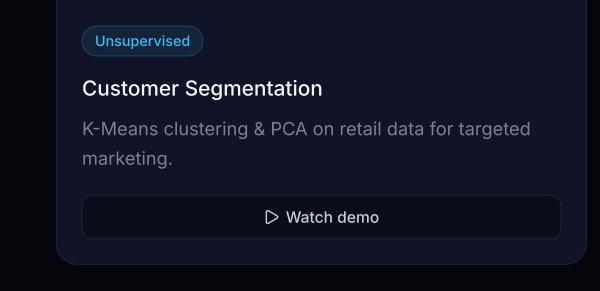</a><a href="https://github.com/umerqureshi40116/student_class_estimator">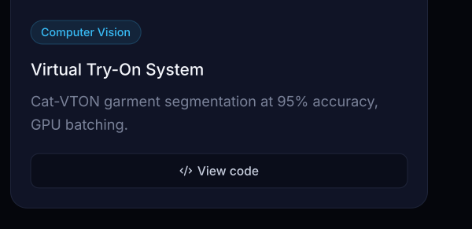</a><a href="https://drive.google.com/file/d/16GL-KCXMQi7sjEXfRL6LpyvVGHMPqnRY/view"></a><a href="https://drive.google.com/file/d/17AdWAg5lq-rl8NKwfFUR9UU0q0Y2BSL1/view"></a><a href="https://github.com/umerqureshi40116/CLOTHING_VIRTUAL_TRYON_WEB_APPLICATION">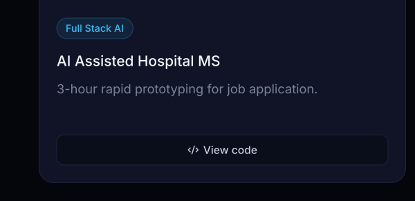</a><a href="https://github.com/umerqureshi40116/IMERA_AI_AI_POWERED_FULL_STACK_APPLICATION">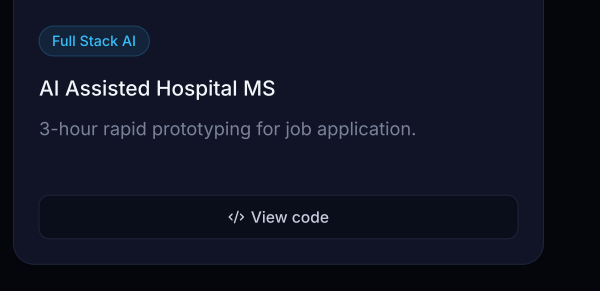</a><a href="https://drive.google.com/file/d/152FC1E_fZE-vGveqrK__TQ2Q6JxbNQKp/view"></a><a href="https://github.com/umerqureshi40116/Diabetes_Risk_Prediction">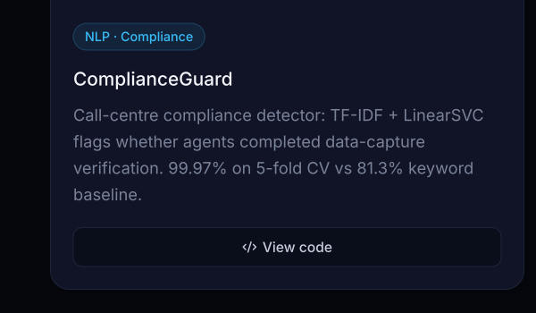</a><a href="https://drive.google.com/file/d/152FC1E_fZE-vGveqrK__TQ2Q6JxbNQKp/view">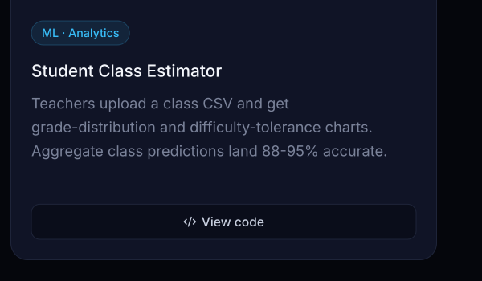</a><a href="https://res.cloudinary.com/dh2tiiokr/image/upload/v1778962745/IMG_20260517_010828_410_thprwg.jpg">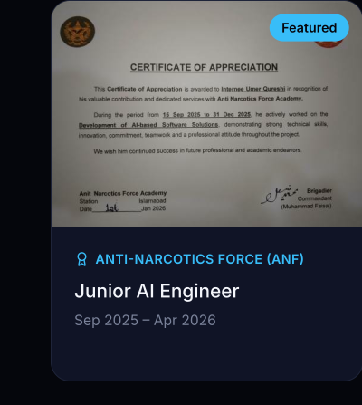</a><a href="https://res.cloudinary.com/dh2tiiokr/image/upload/v1778971885/Muahammad_Umer_Qureshi_page-0001_ezmhy6.jpg">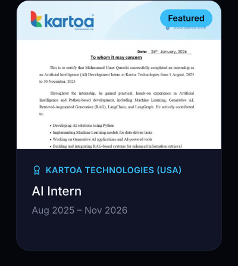</a><a href="https://res.cloudinary.com/dh2tiiokr/image/upload/v1778962620/IBM_Python_Certificate_ryfoeu.jpg">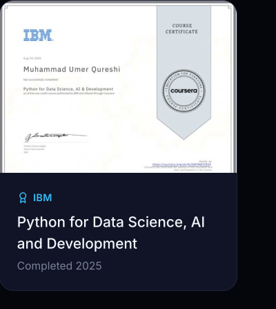</a><a href="https://res.cloudinary.com/dh2tiiokr/image/upload/v1778962621/Cisco_Python_1_Course_tqq5cl.jpg">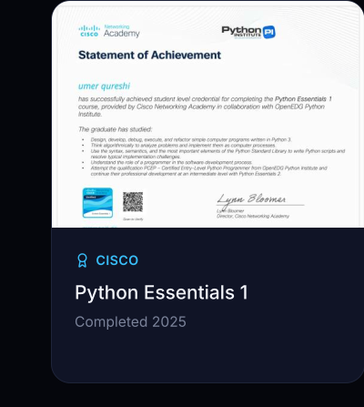</a><a href="https://res.cloudinary.com/dh2tiiokr/image/upload/v1778962770/IMG_20260517_010932_433_n6joud.jpg">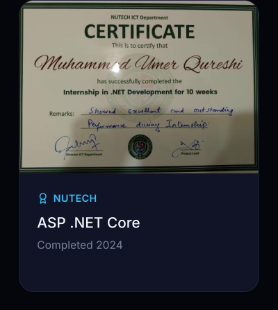</a><a href="https://res.cloudinary.com/dh2tiiokr/image/upload/v1778962621/WhatsApp_Image_2025-08-29_at_11.38.01_PM_1_d2rigj.jpg">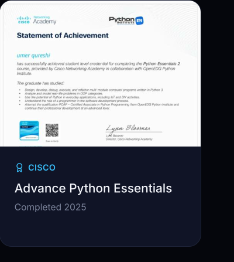</a><a href="https://res.cloudinary.com/dh2tiiokr/image/upload/v1778962621/WhatsApp_Image_2025-08-29_at_11.38.00_PM_curxhh.jpg">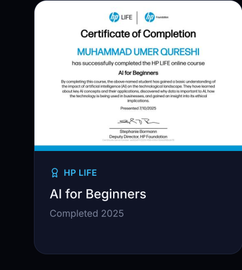</a><a href="https://www.codematically.com">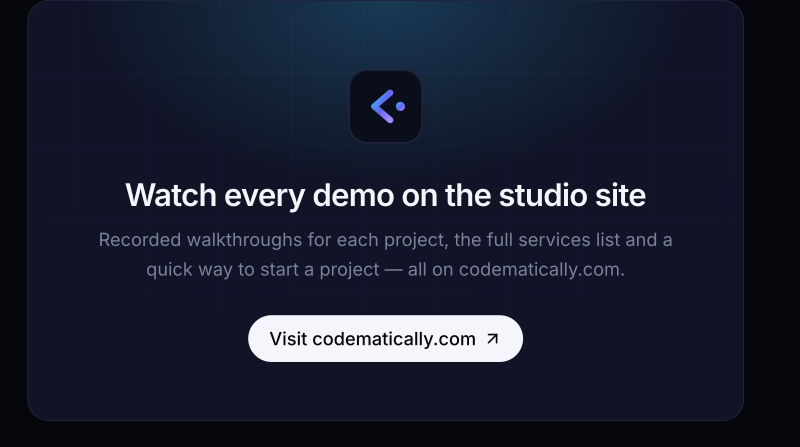</a>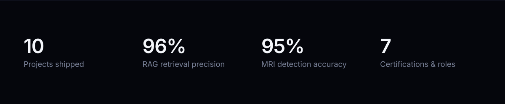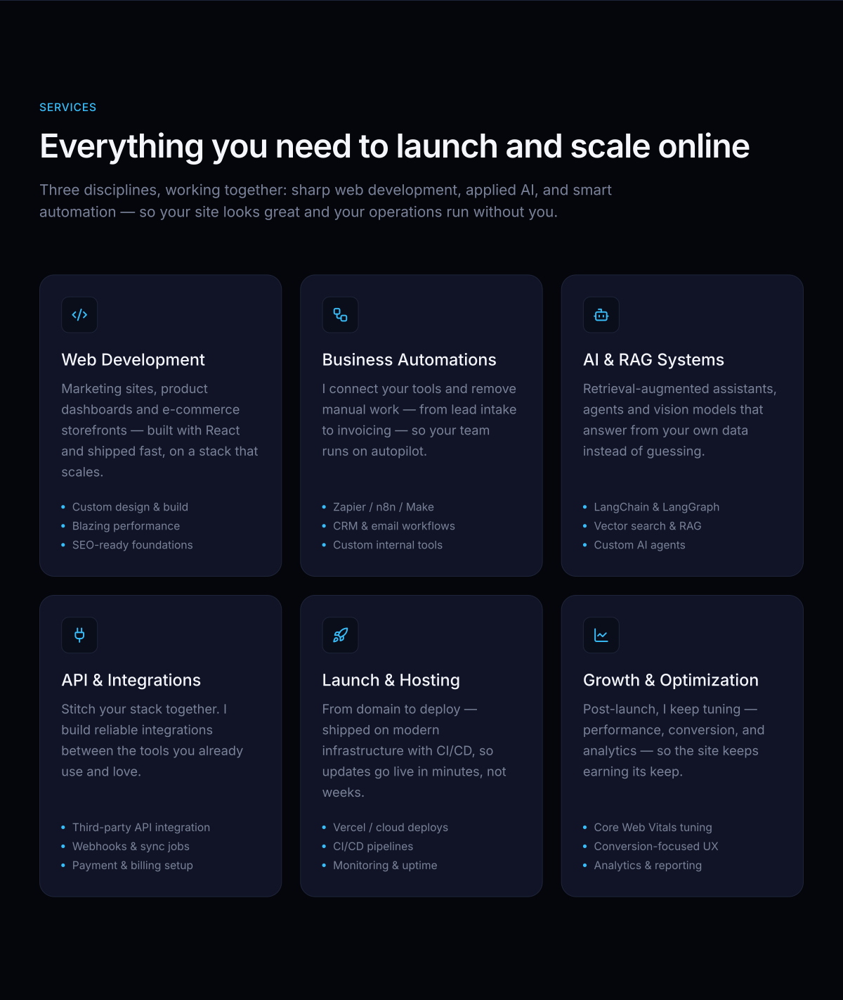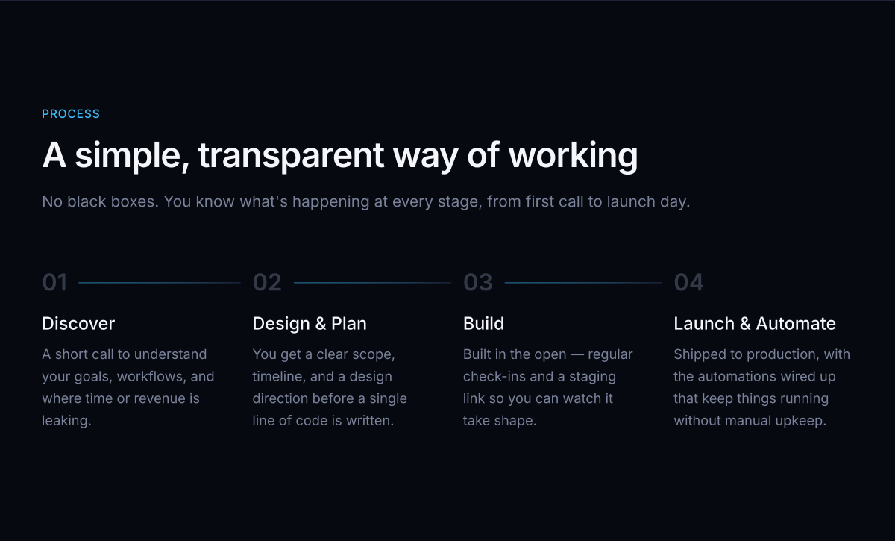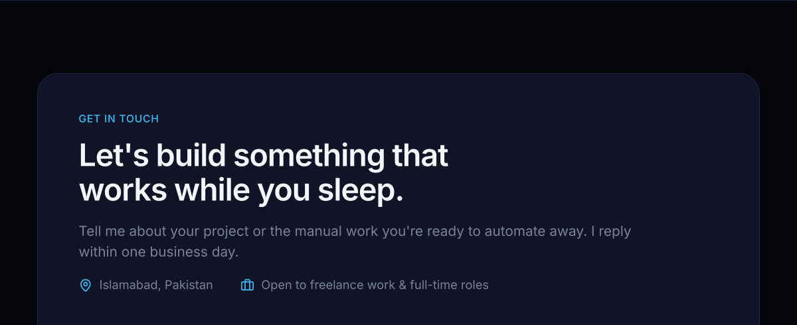<a href="https://www.codematically.com">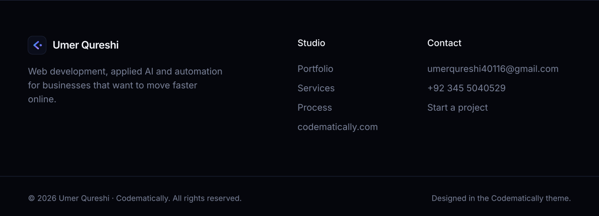</a>
